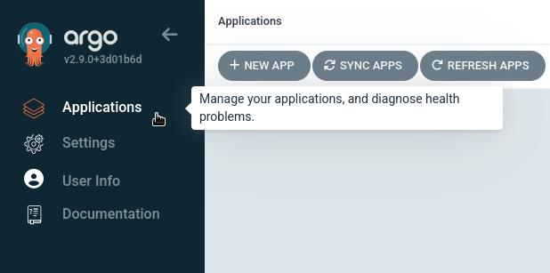
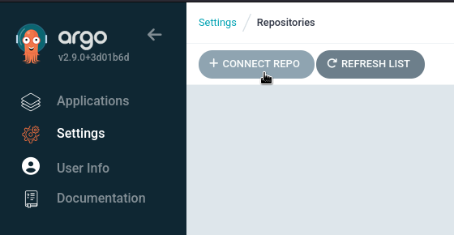
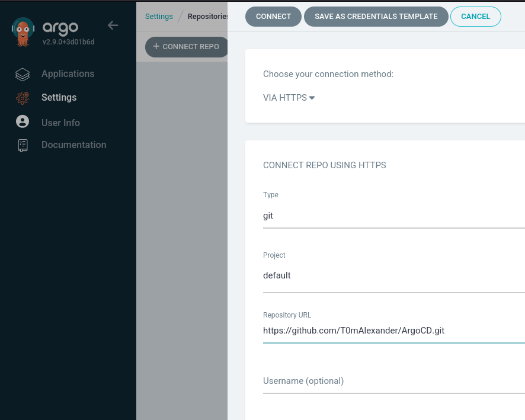
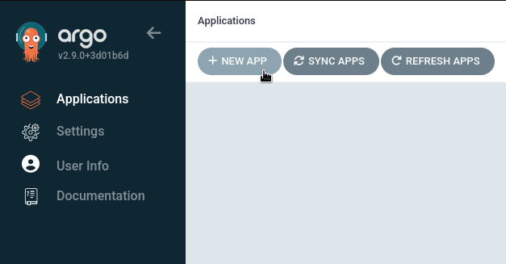
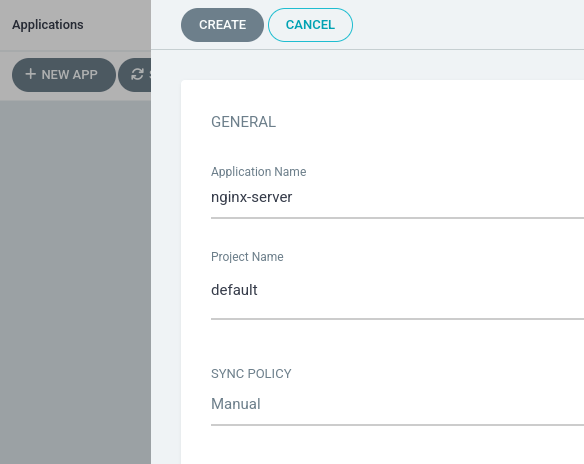
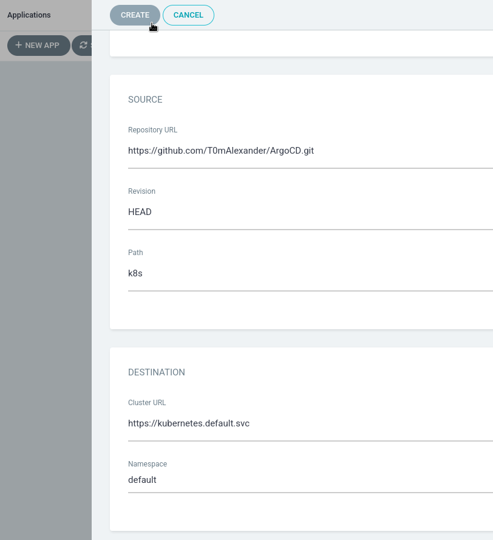

# ArgoCD

## Descrição

Repositório relacionado ao curso [Kubernetes: GitOps with ArgoCD](https://www.linkedin.com/learning/kubernetes-gitops-with-argocd) da plataforma Linkedin Learning

## Pré requisitos

* **[K3D](https://k3d.io/v5.6.0/#installation)** instalado na máquina em versão mínima de 5.6.0
* **[Docker](https://www.docker.com/products/docker-desktop/)** instalado na máquina em versão mínima de 4.x.x
* **[ArgoCD CLI](https://argo-cd.readthedocs.io/en/stable/cli_installation/)** instalado na máquina em versão mínima de 2.6.x

## Instruções de uso

### 1. Crie um arquivo de manifesto

```yml
# cluster-config.yml

apiVersion: k3d.io/v1alpha5
kind: Simple
servers: 1
agents: 2

```

### 1.2 Crie um cluster K3D

```shell
k3d cluster create [nome] --config [arquivo]
```

### 1.2.1 Crie um novo namespace

```shell
kubectl create namespace [nome]
```

> **Sugestão:** nomeie como `argocd` para não haver conflitos com o próximo passo

### 1.2.2 Obtenha o [manifesto do ArgoCD](https://argo-cd.readthedocs.io/en/stable/operator-manual/installation/) e faça instalação

```shell
kubectl apply -n [namespace] -f [arquivo]
```

> **Dica:** o arquivo pode ser encontrado no [repositório do ArgoCD](https://github.com/argoproj/argo-cd) em `/manifests/install.yaml` e o link em **formato RAW** pode ser usado como argumento caso não queira baixar ou copiar o arquivo

### 1.3 Acesse o ArgoCD UI

```shell
kubectl patch svc [api-server] -n [namespace] -p '{"spec": {"type": "NodePort"}}'
```

> **Lembrete:** o servidor da API é acompanhado pelo nome do namespace e terminado com **[namespace]-server** (e.g `argocd-server`)

### 1.3.1 Consulte os serviços

```shell
kubectl -n [namespace] get services
```

> **Dica:** o conjunto de portas é separadas por uma vírgula (e.g **80:30000/TCP**, **443:31000/TCP**)

### 1.3.2 Faça encaminhamento deste segundo conjunto de portas

```shell
kubectl port-forward svc/[api-server] -n [namespace] [porta]:443
```

> **Lembrete:** a porta a ser encaminhada é de escolha livre

### 1.3.3 Obtenha acesso inicial

```shell
kubectl -n [namespace] get secret [namespace]-initial-admin-secret -o jsonpath="{.data.password}" | base64 -d && echo
```

> **AVISO:** o nome de usuário padrão é **admin** e recomenda-se trocar a senha de imediato para futuros acessos

### 1.4 Crie um repositório e crie um serviço e deploy no Kubernetes

```yml
# nginx.deploy.yml

apiKind: apps/v1
kind: Deployment
metadata:
  labels:
    app: nginx
  name: nginx-deployment
spec:
  replicas: 1
  selector:
    app: nginx
  template:
    metadata:
    labels:
      app: nginx
  spec:
    containers:
    - image: nginx:latest
      name: nginx
```

```yml
# nginx.service.yml

apiKind: apps/v1
kind: Service
metadata:
  labels:
    app: nginx
  name: nginx-deployment
  namespace: default
spec:
  ports:
  - port: 80
    protocol: TCP
    targetPort: 80
  selector:
    app: nginx
  type: NodePort
```

**Lembrete:** não esqueça de enviar as alterações, pois o ArgoCD considera o repositório como único referencial

### 1.4.1 Vincule o repositório ao ArgoCD





### 1.4.2 Faça deploy de uma aplicação via ArgoCD




